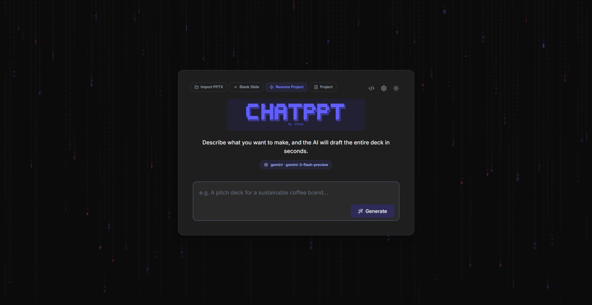
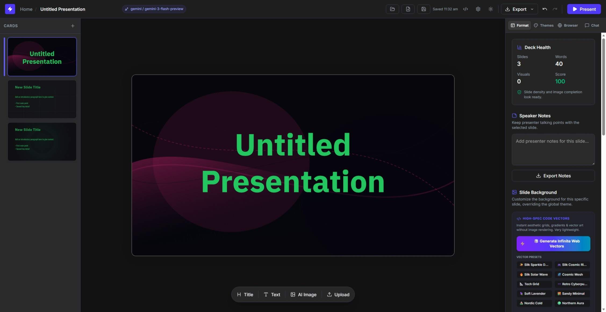

# ChatPPT

```text
 ██████╗ ██╗  ██╗ █████╗ ████████╗██████╗ ██████╗ ████████╗
██╔════╝ ██║  ██║██╔══██╗╚══██╔══╝██╔══██╗██╔══██╗╚══██╔══╝
██║      ███████║███████║   ██║   ██████╔╝██████╔╝   ██║
██║      ██╔══██║██╔══██║   ██║   ██╔═══╝ ██╔═══╝    ██║
╚██████╗ ██║  ██║██║  ██║   ██║   ██║     ██║        ██║
 ╚═════╝ ╚═╝  ╚═╝╚═╝  ╚═╝   ╚═╝   ╚═╝     ╚═╝        ╚═╝
                         by -Pixel
```

**ChatPPT** is a sophisticated, open-source presentation drafting workspace powered by React, TypeScript, and Express. It merges powerful AI generation engines, a precise canvas editing suite, multiple AI model provider backends, and versatile presentation exports into a secure, responsive, and elegant local-first application.

---

Try it here: http://chat-ppt.vercel.app

---

## 📸 Presentation Workspace Preview

Below are the key interfaces you will interact with when using ChatPPT.

<p align="center">
  
  <br />
  <em><strong>Drafting Dashboard:</strong> Prompt-to-presentation workflows combined with rich aesthetic templates.</em>
</p>

<p align="center">
  
  <br />
  <em><strong>Visual Canvas Layer:</strong> Drag, resize, layer, and style elements with live layout snapping.</em>
</p>

---

## 🌟 Core Superpowers

### 🚀 1. Prompt-to-Presentation Generation
* **Instant Outlining:** Generate structured multi-slide decks in seconds based on a short topic or detailed text prompt.
* **Layout Intelligence:** The template engine automatically maps headings, body summaries, bulleted items, and media placeholders into professional visual layouts.
* **Cohesive Theming:** Instantly change typography, color schemes, and canvas structures to match the presentation's mood.

### 💬 2. AI Chat Mode & Canvas Agent Automation
* **Natural Language Control:** Converse with an expert design assistant to brainstorm content, write copy, or refactor layouts.
* **Direct Canvas Actions:** The system parses conversational chat messages into machine commands on the fly. You can ask:
  * *"Add a slide about renewable energy"*
  * *"Make slide 3's background Lavender (#E6E6FA)"*
  * *"Change all titles on slide 4 to green"*
  * *"Set the theme to corporate"*
  * *"Add a text element with the company slogan"*
* **Interactive Element Binding:** Insert suggested content or research snippets from assistant replies directly onto the active canvas.

### 🌐 3. Consolidated High-Quality Research
* **Wikimedia Commons Integration:** Access hundreds of thousands of public-domain, educational, and free-to-use vector graphics, photos, and illustration layouts natively within the image finder.
* **Wikipedia Summaries:** Search abstract concepts directly from the side panel and insert copy as slide elements with one click.
* **Google Web Search Insights:** Retrieve slide-ready facts, statistics, and bulleted takeaways using live web insights.

### 🎨 4. Absolute Element Canvas Suite
* **Interactive Adjustments:** Standardize element dimensions, alignment, layering, opacity, background colors, and typography using the active properties panel.
* **Interactive Viewport Support:** Inspect design details in standard desktop views or test presentation flows with simulated mobile responsive frameworks.
* **Canvas Diagnostics:** Track slide readability, dense paragraph warnings, total word metrics, slide counts, and notes coverage.

### 🧠 5. Flexible Multi-Model Configurations
* **Provider Agnostic:** Securely switch backends between **Gemini**, **OpenAI**, **Claude (Anthropic)**, and **Ollama**.
* **Local Ollama Networking:** Discover and call models hosted on your local Ollama port right from the settings panel.
* **Client-First Key Management:** Save your sensitive API keys inside private browser `localStorage` — keys are never sent to external servers.

### 💾 6. Dynamic Presentation Exports
* **Editable PowerPoint (.pptx):** Compile visual layouts directly into native, editable Microsoft PowerPoint elements via `PptxGenJS`.
* **High-Definition Static PDF/PPTX:** Render each visual canvas slide to a high-definition JPEG, ensuring 100% exact design fidelity in any standard viewer.
* **Standalone HTML Deck:** Export presentations as a single self-contained HTML file featuring CSS transitions and presenter-view controls.
* **Re-import Project Backups:** Export full, editable `.aipres.json` structures to save and load decks at any time.

### ⚡ 7. High-Spec Procedural SVG Vector Backgrounds
* **Lightweight Code Vector Art:** Instead of requesting heavy image assets, instantly generate ultra-lightweight inline `url("data:image/svg+xml;...")` backgrounds featuring smooth mathematical ribbons, procedural bezier curves, starry sparkles, grid points, and gradient swath meshes.
* **Aesthetic Presets & Wave Ribbons:** Instant template panels include beautiful designs like *Silk Cosmic Ribbon*, *Silk Solar Wave*, *Soft Lavender*, *Northern Aura*, and *Silk Sparkles*.
* **Procedural Randomization:** A single tap on the 🎲 *Generate Infinite Web Vectors* randomized engine dynamically constructs custom-paired gradient colorways, spline equations, twinkling stars, and atmospheric vector grids.
* **AI Vector Synthesis:** Input a natural description (such as *"Lavender neon glowing streams, deep cosmic violet"*) and the AI-driven synthesis will construct valid, browser-compatible inline SVG background code for your active slide.
* **Apply Active Background to All Slides:** A powerful global batch utility lets you instantly clone any slide's background pattern, image, or custom CSS styles to every slide in the deck in a single click, maintaining template harmony.

---

## 🛠️ Technology Stack

* **Front-End:** React 19 + TypeScript + Vite 6
* **Canvas Transitions:** Tailwind CSS v4 + Framer Motion
* **Layouts & Rendering:** Lucide React + HTML-to-Image + JSZip
* **Output Compile:** PptxGenJS
* **Back-End Server:** Node.js + Express

---

## 🚀 Installation & Setup

### Prerequisites
* **Node.js** v20 or newer
* A **Gemini API Key** (optional, enter directly in the web UI Settings)

### Setup Instructions
1. **Clone the Repository:**
   ```bash
   git clone https://github.com/your-username/chatppt.git
   cd chatppt
   ```
2. **Install Dependencies:**
   ```bash
   npm install
   ```
3. **Configure Environment:**
   ```bash
   cp .env.example .env
   ```
   Open the `.env` file and insert your API keys:
   ```env
   GEMINI_API_KEY="your_actual_gemini_key_here"
   # Optional additions
   OPENAI_API_KEY="your_openai_key_here"
   OLLAMA_ORIGIN="http://localhost:11434"
   ```

### Run the App
Launch the Express development server coupled with Vite:
```bash
npm run dev
```
Open your browser to [http://localhost:3000](http://localhost:3000).

---

## 💻 Working Commands

* `npm run dev` - Runs the full-stack development instance on port 3000.
* `npm run build` - Bundles the React front-end assets and compiles the Express backend with esbuild.
* `npm run start` - Boots the standalone production-compiled server at `dist/server.cjs`.
* `npm run lint` - Validates TypeScript types and handles project sanitation.

---

## 🔒 Security Best Practices

1. **Keep Secrets Secret:** Never commit your `.env` file or hardcoded keys. The included `.gitignore` protects against accidental uploads of environment configuration.
2. **Local Key Storage:** Entering API keys in the web application's dashboard saves them locally in your browser's private sandbox context (`localStorage`), meaning your keys remain perfectly secure.
